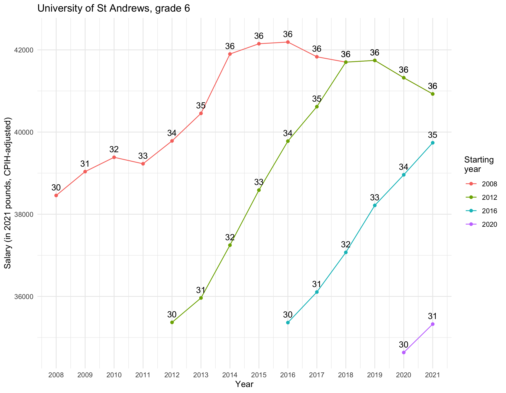

University of St Andrews pay
============================

This repo generates charts of inflation-adjusted (CPIH) pay for different grades at the University of St Andrews.

Inspired by the same plots for [Sheffield University](https://twitter.com/rorfitelli/status/1499056246321733639).

Thanks to Justin Ales for pointers on where to find data.

# Context

In the UK, university pay scales are decided centrally, but the grades they correspond to are decided locally. So, being grade 6 (postdoc) at one institution does not mean that you will get the same salary as a postdoc at another institution.

Note there was a big increase in Oct 2008, because there was an RPI increase see [here for more info](https://www.ucu.org.uk/1707) (thanks to Justin Ales for the explanation).

# Data sources

- CPIH index data from [ONS, here](https://www.ons.gov.uk/economy/inflationandpriceindices/timeseries/l522/mm23)
- National pay scale data from [Edinburgh University, here](https://www.ed.ac.uk/human-resources/pay-reward/pay/archive-pay-scales) as PDFs :(
- University of St Andrews grades [here](https://www.st-andrews.ac.uk/staff/money/salaries/)

# Some plots

